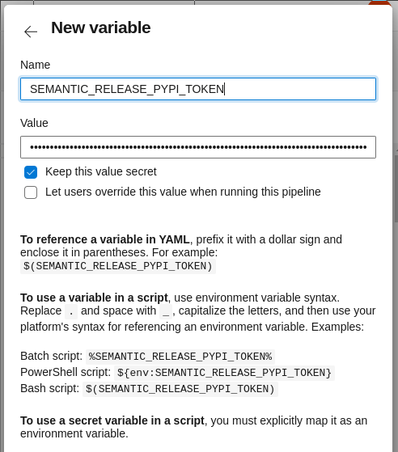

# python-library-template

Python library template focused on code quality and security.

## GitHub repository

Create github repository for your project.


Create issue labels:


## Azure Pipelines

Create azure project.


Enable pipelines option in azure project.

You can create starter pipeline for that purpose.


## Review Bot

Create GitHub bot user: https://danger.systems/js/guides/getting_started.html#github

Generate personal access token for that user: https://docs.github.com/en/github/authenticating-to-github/keeping-your-account-and-data-secure/creating-a-personal-access-token

This token should have only `public_repo` access level.


Add public `DANGER_GITHUB_TOKEN` variable to the azure pipeline.


## Semantic Release

Generate API token for Python Package Index: https://pypi.org/help/#apitoken


Add **secret** `SEMANTIC_RELEASE_PYPI_TOKEN` variable to the azure pipeline.



Generate personal access token for user with push access to the repository: https://docs.github.com/en/github/authenticating-to-github/keeping-your-account-and-data-secure/creating-a-personal-access-token

This token should have only `public_repo` access level if you work on open source project.


Add **secret** `SEMANTIC_RELEASE_GITHUB_TOKEN` variable to the azure pipeline.


**Ensure** you are not allow builds of forks to access secret variables.


## Local repository

First, install dependencies:

```bash
$ pip install cruft
```

Create project:

```bash
$ echo $DANGER_GITHUB_API_TOKEN | base64
$ cruft create https://github.com/proofit404/python-library-template
```

Initialize git repository:

```bash
$ cd the-library
$ git init
```

Create `release` branch:

```bash
$ git checkout -b release
```

Commit created project to the repository:

```bash
$ git add .
$ git commit -m 'Hello world.'
```

Configure origin repository on GitHub:

```bash
$ git remote add origin git@github.com:proofit404/the-library.git
```

Push newly created project to the GitHub:

```bash
$ git push origin release
```

## GitHub repository settings

Change default branch of the repository:


Configure branch protection rule the same way for both `release` and `develop` branches:


Remove `main` branch:


